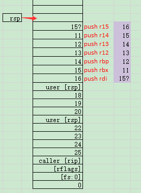

# 上下文切换

> 本节介绍 trapframe-rs 中 [fncall.rs] 的魔法实现

[fncall.rs]: https://github.com/rcore-os/trapframe-rs/blob/master/src/arch/x86_64/fncall.rs

## 保存和恢复通用寄存器

> 定义 UserContext 结构体

`mod.rs`
```
/// User space context
#[derive(Debug, Default, Clone, Copy, Eq, PartialEq)]
#[repr(C)]
pub struct UserContext {
    pub general: GeneralRegs,
    pub trap_num: usize,
    pub error_code: usize,
}
```

该结构体中包含三个field: 

- 通用寄存器(在mod.rs中定义)

    `mod.rs`
```
#[derive(Debug, Default, Clone, Copy, Eq, PartialEq)]
#[repr(C)]
pub struct GeneralRegs {
    pub rax: usize, 
    pub rbx: usize,
    pub rcx: usize,
    pub rdx: usize,
    pub rsi: usize,
    pub rdi: usize,
    pub rbp: usize,
    pub rsp: usize,
    pub r8: usize,
    pub r9: usize,
    pub r10: usize,
    pub r11: usize,
    pub r12: usize,
    pub r13: usize,
    pub r14: usize,
    pub r15: usize,
    pub rip: usize,
    pub rflags: usize,
    pub fsbase: usize,
    pub gsbase: usize,
}
```

寄存器|功能
---|---
rax|函数返回值
rbx|用作数据存储，遵循被调用者使用规则
rcx|用作函数参数，第四个参数
rdx|用作函数参数，第三个参数
rsi|用作函数参数，第二个参数
rdi|用作函数参数，第一个参数
rbp|用作数据存储，遵循被调用者使用规则
rsp|栈指针寄存器，指向栈顶
r8|用作函数参数，第五个参数
r9|用作函数参数，第六个参数
r10|用作数据存储，遵循调用者使用规则
r11|用作数据存储，遵循调用者使用规则
r12|用作数据存储，遵循被调用者使用规则
r13|用作数据存储，遵循被调用者使用规则
r14|用作数据存储，遵循被调用者使用规则
r15|用作数据存储，遵循被调用者使用规则
rip|指令寄存器
rflags|64位标志寄存器
[fsbase](https://wiki.osdev.org/SWAPGS)|Their base addresses are used to calculate effective addresses. FS is used for Thread Local Storage. 
[gsbase](https://wiki.osdev.org/SWAPGS)|Their base addresses are used to calculate effective addresses. The GS register often holds a base address to a structure containing per-CPU data.

- 陷阱号

    计算机有两种运行模式：用户态， 内核态。 其中操作系统运行在内核态，在内核态中，操作系统具有对所有硬件的完全访问权限，可以使机器运行任何指令；相反，用户程序运行在用户态，在用户态下，软件只能使用少数指令，它们并不具备直接访问硬件的权限。假如软件需要访问硬件或者需要调用内核中的函数时，就需要陷阱。陷阱指令可以使执行流程从用户态陷入内核并把控制权转移给操作系统，使得用户程序可以调用内核函数和使用硬件从而获得操作系统所提供的服务。
  
- 错误代码
  
    函数调用返回的错误代码


> 保存 callee-saved 寄存器到栈上，恢复 UserContext 寄存器，进入用户态，我们将这个过程命名为syscall_fn_return:

```
global_asm!(
    r#"
.intel_syntax noprefix

    # extern "sysv64" fn syscall_fn_return(&mut UserContext)
syscall_fn_return:
    # save callee-saved registers
    push r15
    push r14
    push r13
    push r12
    push rbp
    push rbx

    push rdi
    SAVE_KERNEL_STACK
    mov rsp, rdi

    POP_USER_FSBASE

    # pop trap frame (struct GeneralRegs)
    pop rax
    pop rbx
    pop rcx
    pop rdx
    pop rsi
    pop rdi
    pop rbp
    pop r8                  # skip rsp
    pop r8
    pop r9
    pop r10
    pop r11
    pop r12
    pop r13
    pop r14
    pop r15
    pop r11                 # r11 = rip. FIXME: don't overwrite r11!
    popfq                   # pop rflags
    mov rsp, [rsp - 8*11]   # restore rsp
    jmp r11                 # restore rip
"#
);
```

> 反之，将rsp指向内核栈，保存通用寄存器到栈上，恢复 callee-saved 寄存器，进入内核态，我们将这个过程命名为 syscall_fn_entry:

```
global_asm!(
    r#"
.intel_syntax noprefix
syscall_fn_entry:
    # save rsp
    lea r11, [rsp + 8]      # save rsp to r11 (clobber)

    SWITCH_TO_KERNEL_STACK
    pop rsp
    lea rsp, [rsp + 20*8]   # rsp = top of trap frame

    # push trap frame (struct GeneralRegs)
    push 0                  # ignore gs_base
    PUSH_USER_FSBASE
    pushfq                  # push rflags
    push [r11 - 8]          # push rip
    push r15
    push r14
    push r13
    push r12
    push r11
    push r10
    push r9
    push r8
    push r11                # push rsp
    push rbp
    push rdi
    push rsi
    push rdx
    push rcx
    push rbx
    push rax

    # restore callee-saved registers
    SWITCH_TO_KERNEL_STACK
    pop rbx
    pop rbx
    pop rbp
    pop r12
    pop r13
    pop r14
    pop r15

    SWITCH_TO_KERNEL_FSBASE

    # go back to Rust
    ret
"#
);
```


## 找回内核上下文：线程局部存储 与 FS 寄存器

> 在用户程序跳转回内核代码的那一刻，如何在不破坏用户寄存器的情况下切换回内核栈？
> 
> 想要进入内核栈，我们应让rsp(栈顶指针)指向kernel stack

在fsbase中，如下，存储了一个段表的起始地址

User: (musl)
- fs:0  (pthread.self)       = user fsbase
- fs:48 (pthread.canary2)    = kernel fsbase

Kernel: (glibc)
- fs:0  (pthread.self)       = kernel fsbase
- fs:64 (pthread.???)        = kernel stack
- fs:72 (pthread.???)        = init user fsbase

因此，我们定义一个宏方便调用。
代码如下:
```
.macro SWITCH_TO_KERNEL_STACK
    mov rsp, fs:48          # rsp = kernel fsbase
    mov rsp, [rsp + 64]     # rsp = kernel stack
.endm
```
其中，rsp为栈顶指针
在`mov rsp, fs:48`后, FS与rsp寄存器如下:

在`mov rsp, [rsp + 64]`后, FS与rsp寄存器如下:


>
> 进入用户态前，将内核栈指针保存在内核 glibc 的 TLS 区域中。为此我们需要查看 glibc 源码，找到一个空闲位置。

|||
|-|-|
|SAVE_KERNEL_STACK|将rsp的内容存进fs:64<br>- fs:64 (pthread.???)        = kernel stack|

代码如下:
```
.macro SAVE_KERNEL_STACK
    mov fs:64, rsp
.endm
```
即,将当前rsp寄存器中的内容作为kernel stack写入fs:48中

|||
|-|-|
|PUSH_USER_FSBASE|将fs:0(user fsbase)的内容压入栈|
```
.macro PUSH_USER_FSBASE
    push fs:0
.endm
```

> Linux 和 macOS 下如何分别通过系统调用设置与还原 fsbase / gsbase

> 在Linux中:
> 
|||
|-|-|
|SWITCH_TO_KERNEL_FSBASE|从ring3进入ring0,并且将fs寄存器所指向的fsbase由user fsbase切换为kernel fsbase|
|POP_USER_FSBASE|还原user fsbase|

代码如下:
```
.macro SWITCH_TO_KERNEL_FSBASE
    mov eax, 158            # SYS_arch_prctl
    mov edi, 0x1002         # SET_FS
    mov rsi, fs:48          # rsi = kernel fsbase
    syscall
.endm
```
其中, eax中储存了系统调用号158, 即SYS_arch_prctl, edi和rsi中储存了参数(0x1002, fs:48), 使用syscall命令执行系统调用, 作用是将fs:48中的地址(kernel fsbase)写入fs寄存器中

如图:


```
.macro POP_USER_FSBASE
    mov rsi, [rsp + 18 * 8] # rsi = user fsbase
    mov rdx, fs:0           # rdx = kernel fsbase
    test rsi, rsi           # if [rsp + 18 * 8] is 0
    jnz 1f                  # if not 0, goto set
0:  lea rsi, [rdx + 72]     # rsi = init user fsbase
    mov [rsi], rsi          # user_fs:0 = user fsbase
    # if 0, user_fs:0 = init user fsbase

1:  mov eax, 158            # SYS_arch_prctl
    mov edi, 0x1002         # SET_FS
    syscall                 # set fsbase

    # if not 0, set FS to [rsp + 18 * 8]

    mov fs:48, rdx          # user_fs:48 = kernel fsbase

.endm
```

FS寄存器设置为user fsbase

如果[rsp + 18 * 8]不为空，user fsbase = [rsp + 18 * 8]；

如果[rsp + 18 * 8]为空，user fsbase为初始user fsbase；将user_fs:48设置为kernel fsbase

> 在macOS中，与在Linux中相似，区别在于需要设置GS，下面给出代码

```
// User: (musl)
// - gs:0   (pthread.self)      = user gsbase
// - gs:48  (pthread.canary2)   = kernel gsbase
//
// Kernel: (darwin)
// - gs:0   (pthread.tsd[self]) = kernel gsbase - 224
// - gs:48  (pthread.tsd[6])    = kernel stack
// - gs:240 (pthread.tsd[30])   = init user fsbase
//
// Ref:
// - Set gsbase:
//   - https://gist.github.com/aras-p/5389747
// - Get gsbase:
//   - https://github.com/DynamoRIO/dynamorio/issues/1568#issuecomment-239819506
//   - https://github.com/apple/darwin-libpthread/blob/03c4628c8940cca6fd6a82957f683af804f62e7f/src/internal.h#L241
#[cfg(target_os = "macos")]
global_asm!(
    r#"
.macro SWITCH_TO_KERNEL_STACK
    mov rsp, gs:48          # rsp = kernel gsbase
    mov rsp, [rsp + 48]     # rsp = kernel stack
.endm
.macro SAVE_KERNEL_STACK
    mov gs:48, rsp
.endm
.macro PUSH_USER_FSBASE
    push gs:0
.endm
.macro SWITCH_TO_KERNEL_FSBASE
    mov rdi, gs:48          # rdi = kernel gsbase
    mov eax, 0x3000003
    syscall                 # set gsbase
.endm
.macro POP_USER_FSBASE
    mov rdi, [rsp + 18 * 8] # rdi = user gsbase
    mov rsi, gs:0
    add rsi, 224            # rsi = kernel gsbase
    test rdi, rdi
    jnz 1f                  # if not 0, goto set
0:  lea rdi, [rsi + 30*8]   # rdi = init user gsbase
                            #     = pthread.tsd[30] (kernel gsbase + 30 * 8)
    mov [rdi], rdi          # user_gs:0 = user gsbase
1:  mov eax, 0x3000003
    syscall                 # set gsbase
    mov gs:48, rsi          # user_gs:48 = kernel gsbase
.endm

.global _syscall_fn_entry
.global syscall_fn_entry
.global _syscall_fn_return
.set _syscall_fn_entry, syscall_fn_entry
.set _syscall_fn_return, syscall_fn_return
"#
);
```

## 测试

> 编写单元测试验证上述过程

<table>
<tr><th>code</th><th>explanation</th></tr>

<tr>
<td><pre lang="rust">
#[cfg(test)]
mod tests {
    use crate::*;

    #[cfg(target_os = "macos")]
    global_asm!(".set _dump_registers, dump_registers");
</pre></td>

<td>
这里定义了dump_registers
</td>
</tr>

<tr>
<td><pre lang="rust">
    // Mock user program to dump registers at stack.
    global_asm!(
        r#"
.intel_syntax noprefix
dump_registers:
    push r15
    push r14
    push r13
    push r12
    push r11
    push r10
    push r9
    push r8
    push rsp
    push rbp
    push rdi
    push rsi
    push rdx
    push rcx
    push rbx
    push rax
    add rax, 10
    add rbx, 10
    add rcx, 10
    add rdx, 10
    add rsi, 10
    add rdi, 10
    add rbp, 10
    add r8, 10
    add r9, 10
    add r10, 10
    add r11, 10
    add r12, 10
    add r13, 10
    add r14, 10
    add r15, 10
    call syscall_fn_entry
"#
    );

</pre></td>

<td>
这里是dump_registers的代码，程序的流程功能：
1、将rax等16个通用寄存器的值压栈
2、每个通用寄存器的值加10
3、调用syscall_fn_entry
</td>
</tr>


<tr>
<td><pre lang="rust">
#[test]
fn run_fncall() {
    extern "sysv64" {
        fn dump_registers();
    }
    let mut stack = [0u8; 0x1000];
    let mut cx = UserContext {
        general: GeneralRegs {
            rax: 0,
            rbx: 1,
            rcx: 2,
            rdx: 3,
            rsi: 4,
            rdi: 5,
            rbp: 6,
            rsp: stack.as_mut_ptr() as usize + 0x1000,
            r8: 8,
            r9: 9,
            r10: 10,
            r11: 11,
            r12: 12,
            r13: 13,
            r14: 14,
            r15: 15,
            rip: dump_registers as usize,
            rflags: 0,
            fsbase: 0, // don't set to non-zero garbage value
            gsbase: 0,
        },
        trap_num: 0,
        error_code: 0,
    };
</pre></td>

<td>
run_fncall的流程：
1. 定义一个数组stack，长度0x1000，内容为0
2. 定义一个UserContext结构cx，并且进行初始化，初始化之后数据如下图所示：
</img>

3. 由于rip的值为dump_register，因此此时会进入dump_register的代码：
push寄存器和修改寄存器的值，stack的内容如下图所示：
</img>

此时，调用syscall_fn_entry，kernel stack的内容变化如下图所示：
</img>

</img>

【注】：代码中两次pop rbx，是否笔误？
<td>
</tr>

<tr>
<td><pre lang="rust">
cx.run_fncall();
</pre></td>
<td>
4. 从dump_register返回后，调用run_fncall(&mut self)，代码为：
<pre>
{  
unsafe { syscall_fn_return(self); }
          self.trap_num = 0x100; 
self.error_code = 0; 
}
</pre>
调用syscall_fn_return，kernel stack的内容变化如下图所示：
保存被调用者寄存器：
</img>

恢复GeneralRegs
</img>
</td>
</tr>

<tr>
<td><pre>
// check restored registers
let general = unsafe { *(cx.general.rsp as *const GeneralRegs) };
assert_eq!(
    general,
        GeneralRegs {
            rax: 0,
            rbx: 1,
            rcx: 2,
            rdx: 3,
            rsi: 4,
            rdi: 5,
            rbp: 6,
            // skip rsp
            r8: 8,
            r9: 9,
            r10: 10,
            // skip r11
            r12: 12,
            r13: 13,
            r14: 14,
            r15: 15,
            ..general
        }
    );
</pre></td>
<td>
5. 检查恢复的寄存器：
</img>
</td>
</tr>

<tr>
<td><pre>
// check saved registers
assert_eq!(
    cx.general,
    GeneralRegs {
        rax: 10,
        rbx: 11,
        rcx: 12,
        rdx: 13,
        rsi: 14,
        rdi: 15,
        rbp: 16,
        // skip rsp
        r8: 18,
        r9: 19,
        r10: 20,
        // skip r11
        r12: 22,
        r13: 23,
        r14: 24,
        r15: 25,
        ..cx.general
    }
);
assert_eq!(cx.trap_num, 0x100);
assert_eq!(cx.error_code, 0);
</pre></td>
<td>
6. 检查保存的寄存器
</img>

【注】：除rax之外，其余寄存器都相等
</td>
</tr>


</table>

## macOS 的麻烦：动态二进制修改

> 由于 macOS 用户程序无法修改 fs 寄存器，当运行相关指令时会访问非法内存地址触发段错误。
> 
> 我们需要实现段错误信号处理函数，并在其中动态修改用户程序指令，将 fs 改为 gs。
